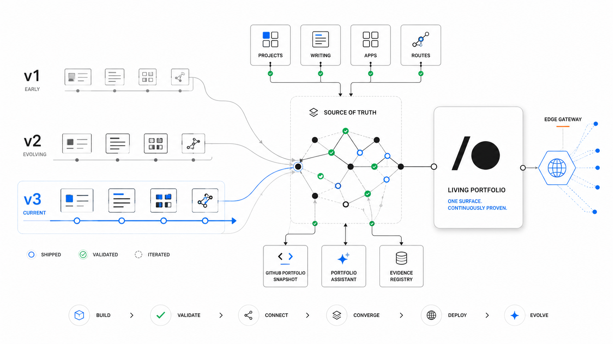

  

# Portfolio

Personal portfolio and proof-of-work publishing system for Joseph Sabag.

This repo powers a living portfolio website, not a static resume. It ties together project
evidence, writing, apps, experiments, version eras, and the Portfolio Assistant so recruiters
can quickly understand the engineer, the unusual path, and the shipped work behind the claims.

## Shape

- `clientV3/` is the living React 19 + Vite + Tailwind app served at `/`.
- `clientV1/` and `clientV2/` are frozen buildable portfolio eras served at `/v1/` and `/v2/`.
- `server/` powers the Portfolio Assistant and contact-email API.
- `worker/` serves the unified Cloudflare deployment.
- `shared/` holds runtime-neutral portfolio modules used across the app, server, and worker.

## Docs

- `PROJECT.md` explains the product purpose.
- `CONTEXT.md` maps the repo shape.
- `LANGUAGE.md` defines the shared domain terms.
- `CODE-STYLE.md` is the source for implementation style.
